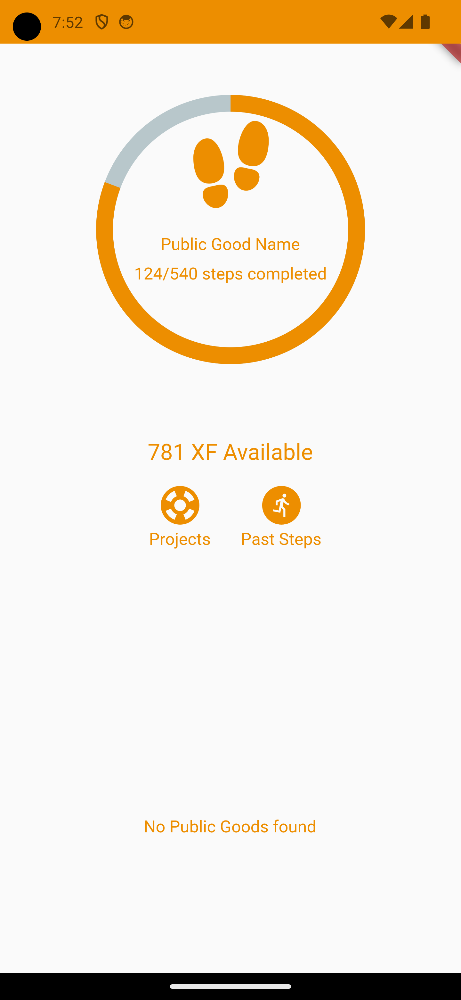
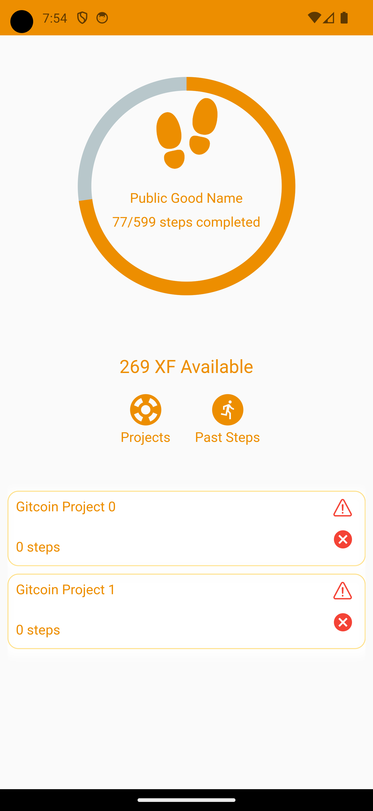
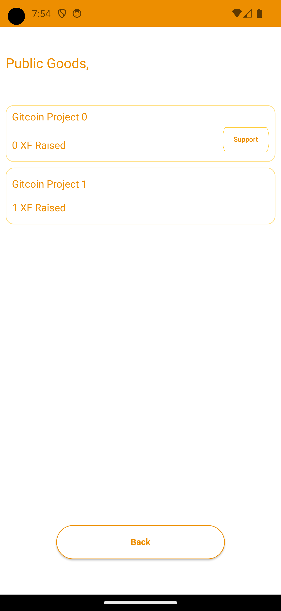
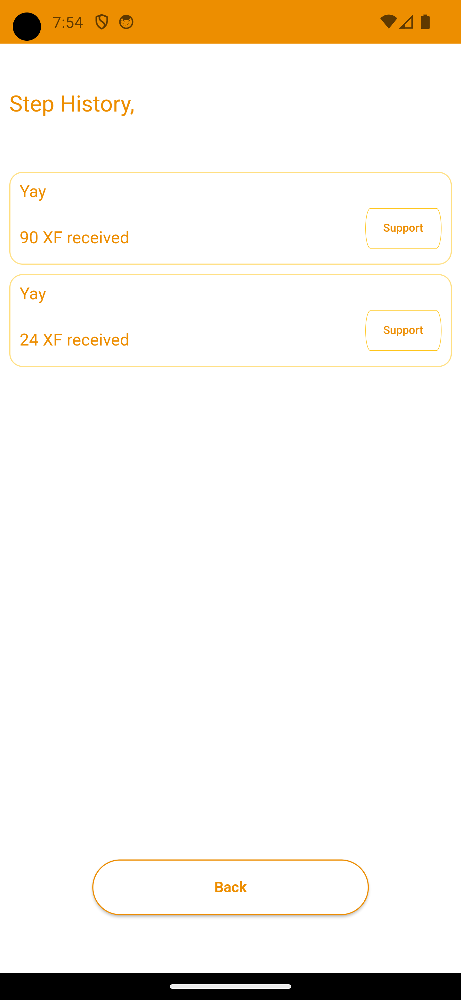

# fpg

This was a POC for a hackathon but gave up because i got another better idea just uploading it here for reference the app uses RiverPod + MVVM for managing state and navigation between views, I got as far as mocking up the UI just got demotivated by the trouble of having to integrate with JS libraries via a central express app since i was integrating with npm packages not available in dart

## Screenshots

1. 
2. 
3. 
4. 
